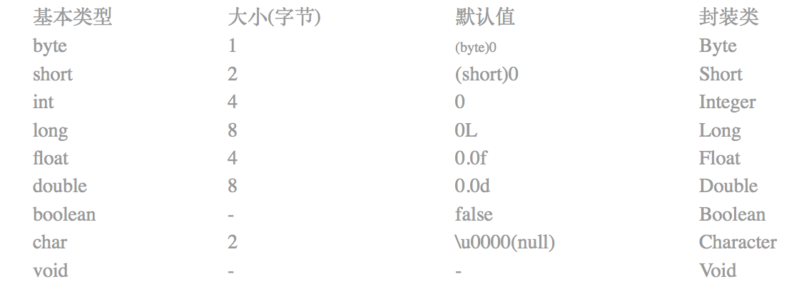

## Java 基础问题整理
### GC 回收，原理？
xxx

### 类加载机制？
虚拟机把描述类的数据从Class文件加载到内存，并对数据进行校验，转换解析和初始化，最终形成可以被虚拟机直接使用的Java类型，这一个过程为类加载机制。


### String 相关问题整理

#### 如何比较两个字符串？使用“==”还是equals()方法？
“==” 测试的是两个对象的引用是否相同；<br>
equals()比较的是两个字符串的值是否相等。<br>
除非你想检查的是两个字符串是否是同一个对象，否则你应该使用equals()来比较字符串。<br>

#### [.equals() 和 == 区别？](https://www.jianshu.com/p/08445889bbb1)
- 首先的区别是，equals() 是方法，而 == 是操作符；
- 对于基本类型的变量来说（如 short、 int、 long、 float、 double），只能使用 == ，因为这些基本类型的变量没有 equals 方法。对于基本类型变量的比较，使用 == 比较， 一般比较的是它们的值。
- 对于引用类型的变量来说（例如 String 类）才有 equals 方法，因为 String 继承了 Object 类， equals 是 Object 类的通用方法。对于该类型对象的比较，默认情况下，也就是没有复写 Object 类的 equals 方法，使用 == 和 equals 比较是一样效果的，都是比较的是它们在内存中的存放地址。
- 对于 equals 方法被重写的情况, 以 String 类为例, String 类复写了 equals 方法，当使用 == 比较内存的存放地址不相等时，接下来会比较字符串的内容是否 相等，所以 String 类中的 equals 方法会比较两者的字符串内容是否一样。内容的比较。
 
#### String、StringBuffer、StringBuilder
String字符串常量，用于存放字符的数组被声明为final，因此只能赋值一次，不可再更改。<br>
频繁使用 String 来操作字符串实际上是在不断地创建新的对象，这样会对系统的性能产生影响，适用于操作少量数据。<br>
StringBuffer 字符串变量，适合于多线程操作下操作大量数据，线程安全的可变字符序列<br>
StringBuilder 字符串变量，适合于单线程下操作大量数据，线程不安全的可变字符序列<br>
String 对象的字符串拼接在编译时会转化成 StringBuilder 的 append 操作<br>
运行速率   String < StringBuffer < StringBuilder<br>

String s = new String(“111") 创造了几个对象？<br>

会创造两个对象。Java为了避免产生大量的String对象，设计了一个字符串常量池。JDK6之前版本，常量池的内存在永久代进行分配，JDK7之后常量池的内存在Java堆中进行分配。创建一个字符串时，JVM首先检查字符串常量池中是否有相等的字符串，如果有则不再创建并返回该字符串的引用地址；如果没有则在字符串常量中创建字符串并返回该字符串的引用地址。<br>
new 一个 String 对象时还会在堆内存中创建一个新的对象。<br>

String为啥设计成不可变的？<br>

用于存放字符的数组被声明为final，因此只能赋值一次，不可再更改，而且String 也没有对外暴露修改数组的方法。
修改String时，不会在原有的内存地址修改，而是重新指向一个新对象。
不可变性可以保证线程安全以及字符串串常量池的实现。

可以重新赋值么？<br>
可以通过反射的Field方法获取到当前对象的成员变量并重新赋值；<br>


#### String 相关待整理...


<br>
<br>

### Java的强、软、弱、虚四种引用的区别?
强引用：代码中普遍存在的，只要强引用还存在，垃圾收集器就不会回收掉被引用的对象。<br>
软引用：SoftReference，用来描述还有用但是非必须的对象，当内存不足的时候回收这类对象。<br>
弱引用：WeakReference，用来描述非必须对象，弱引用的对象只能生存到下一次 GC 发生时，当 GC 发生时，无论内存是否足够，都会回收该对象。<br>
虚引用：PhantomReference，一个对象是否有虚引用的存在，完全不会对其生存时间产生影响，可通过判断引用队列是否加入虚引用来回收对象。<br>

### final 和 finally 和 finalize 的区别？
final修饰符(关键字)<br>
类被声明为final，它不能派生出新的子类，不能作为父类被继承；<br>
方法被声明为final，只能使用，不能重写；<br>
变量声明为final，在使用过程中不会改变，只能读取不可修改。<br>

finally(用于异常处理)<br>
一般用于异常处理中，finally是对异常处理的补充，finally结构使代码总会执行，不管有无异常发生。使用finally可以维护对象的内部状态，并可以清理资源<br>

finalize(用于垃圾回收)<br>
Object中定义的方法，使用finalize()方法在垃圾收集器将对象从内存中回收之前做必要的清理工作

### Java 静态代理和动态代理
为某个对象提供一个代理，以控制对这个对象的访问<br>
静态代理：程序运行前就已经存在代理类的字节码文件，代理类和委托类的关系在运行前就已经确定<br>
动态代理：程序运行期时由 JVM 动态的生成，代理类和委托类的关系是在运行时确定。<br>
使用场景：如果需要对多个类进行代理，并且代理的功能都是一样的，用静态代理重复编写代理类就非常的麻烦，可以用动态代理动态的生成代理类。RxJava 里就有使用动态代理。<br>

### Java 内存中堆和栈的区别
> 参考：https://www.jianshu.com/p/947a76e2ddbc

**堆内存** 

是用于存储 Java 中的对象和数组，当我们 new 一个对象或者创建一个数组的时候，就会在堆内存中开辟一段空间给他，用于存放。<br>
堆内存的特点是先进先出，后进后出，堆是在运行时动态的分配内存大小，缺点是存取速度较慢。

堆内存用于存放由new创建的对象和数组。<br>
在堆内存中分配的内存空间，由java虚拟机自动垃圾回收器来管理。在堆中产生了一个数组或者对象后，还可以在栈中定义一个特殊的变量，变量的值就等于数组或对象在堆内存中的首地址，而这个栈中的特殊变量，也就成为数组或对象的引用变量。以后可以在程序中使用栈内存中的引用变量访问堆内存中的数组或对象了。引用变量相当于是为数组或对象起的一个别名，或者是代号。<br>
**数组和对象在没有引用变量指向它的时候，才变成垃圾，不能被继续使用，但是仍然会占用堆内存空间，而后在一个不确定的时间内，由java虚拟机自动垃圾回收器回收，这也是java程序为什么会占用很大内存的原因。**<br>


**栈内存** 

是用来执行程序用的，存放基本类型的变量和对象的引用变量.<br>
栈内存的特点是先进后出，后进先出，栈内存存取速度比堆要快，栈数据可以共享，缺点是存在栈中的数据大小与生存期必须是确定的，缺乏灵活性。<br>

在函数中定义的基本类型的变量和对象的引用变量都是在函数的栈内存中分配<br>。
当在一段代码块中声明了一个变量时，java就会在栈内存中为这个变量分配内存空间，当超过变量的作用域之后，java也会自动释放为该变量分配的空间，而这个回收的空间可以即刻用作他用。<br>


### [遍历 Map 对象的四种方式？](https://blog.csdn.net/tjcyjd/article/details/11111401 )
既然java中的所有map都实现了Map接口，以下方法适用于任何map实现（HashMap, TreeMap, LinkedHashMap, Hashtable, 等等）

**在for-each循环中使用entries来遍历**<br>
这是最常见的并且在大多数情况下也是最可取的遍历方式。在键值都需要时使用。

```
Map<Integer, Integer> map = new HashMap<Integer, Integer>();

for (Map.Entry<Integer, Integer> entry : map.entrySet()) {
    System.out.println("Key = " + entry.getKey() + ", Value = " + entry.getValue());
}
```

注意：for-each循环在java 5中被引入所以该方法只能应用于java 5或更高的版本中。如果你遍历的是一个空的map对象，for-each循环将抛出NullPointerException，因此在遍历前你总是应该检查空引用。

**在for-each循环中遍历keys或values**
如果只需要 map 中的键或者值，你可以通过 keySet 或 values 来实现遍历，而不是用 entrySet。

该方法比entrySet遍历在性能上稍好（快了10%），而且代码更加干净

```
Map<Integer, Integer> map = new HashMap<Integer, Integer>();
 
//遍历map中的键
for (Integer key : map.keySet()) {
    System.out.println("Key = " + key); 
}
 
//遍历map中的值
for (Integer value : map.values()) {
    System.out.println("Value = " + value); 
}
```

#### 使用Iterator遍历
使用泛型：

```
Map<Integer, Integer> map = new HashMap<Integer, Integer>(); 
Iterator<Map.Entry<Integer, Integer>> entries = map.entrySet().iterator(); 
while (entries.hasNext()) { 
    Map.Entry<Integer, Integer> entry = entries.next(); 
    System.out.println("Key = " + entry.getKey() + ", Value = " + entry.getValue()); 
}
```


不使用泛型：

```
Map map = new HashMap();
Iterator entries = map.entrySet().iterator(); 
while (entries.hasNext()) {
    Map.Entry entry = (Map.Entry) entries.next(); 
    Integer key = (Integer)entry.getKey(); 
    Integer value = (Integer)entry.getValue(); 
    System.out.println("Key = " + key + ", Value = " + value);
}
```

你也可以在keySet和values上应用同样的方法。

该种方式看起来冗余却有其优点所在。首先，在老版本java中这是惟一遍历map的方式。另一个好处是，你可以在遍历时调用iterator.remove()来删除entries，另两个方法则不能。根据javadoc的说明，如果在for-each遍历中尝试使用此方法，结果是不可预测的。

从性能方面看，该方法类同于 for-each 遍历（即方法二）的性能。

#### 通过键找值遍历（效率低）
```
Map<Integer, Integer> map = new HashMap<Integer, Integer>();
for (Integer key : map.keySet()) {
    Integer value = map.get(key);
    System.out.println("Key = " + key + ", Value = " + value);
}
```

作为方法一的替代，这个代码看上去更加干净；但实际上它相当慢且无效率。因为从键取值是耗时的操作（与方法一相比，在不同的Map实现中该方法慢了20%~200%）。如果你安装了FindBugs，它会做出检查并警告你关于哪些是低效率的遍历。所以尽量避免使用。

#### 总结

如果仅需要键(keys)或值(values)使用方法二。如果你使用的语言版本低于java 5，或是打算在遍历时删除entries，必须使用方法三。否则使用方法一(键值都要)。

<br>

### list 与 Set、Map区别及适用场景
List,Set都是继承自 Collection 接口，Map则不是

List特点：元素有放入顺序，元素可重复；list支持for循环，也就是通过下标来遍历，也可以用迭代器；<br>
Set特点：元素无放入顺序，元素不可重复，重复元素会覆盖掉，（注意：元素虽然无放入顺序，但是元素在set中的位置是有该元素的HashCode决定的，其位置其实是固定的，加入Set 的 Object必须定义equals()方法 ，set 只能用迭代，因为他无序，无法用下标来取得想要的值。） 

Set 和 List 对比： <br>
Set：检索元素效率低下，删除和插入效率高，插入和删除不会引起元素位置改变。 <br>
List：和数组类似，List可以动态增长，查找元素效率高，插入删除元素效率低，因为会引起其他元素位置改变。 

Map 适合储存键值对的数据

线程安全集合类与非线程安全集合类 
LinkedList、ArrayList、HashSet 是非线程安全的，Vector 是线程安全的;<br>
HashMap 是非线程安全的，HashTable 是线程安全的;<br>
StringBuilder 是非线程安全的，StringBuffer 是线程安全的。<br>

#### HashSet 和 HashMap 怎么判断集合元素重复？<br>
需要重写 hashcode 方法与 equals 方法，先判断 hashcode 是否相等，再判断是否 equals。<br>


### ArrayList 与 LinkedList 的区别和适用场景

#### Arraylist：
优点：ArrayList 是实现了基于动态数组的数据结构,因为地址连续，一旦数据存储好了，查询操作效率会比较高（在内存里是连着放的）。<br>
缺点：因为地址连续， ArrayList 要移动数据,所以插入和删除操作效率比较低。

#### LinkedList：
优点：LinkedList基于链表的数据结构,地址是任意的，所以在开辟内存空间的时候不需要等一个连续的地址，对于新增和删除操作 add、remove，LinedList比较占优势。LinkedList 适用于 头尾操作 或 插入指定位置 的场景。<br>
缺点：因为LinkedList要移动指针,所以查询操作性能比较低。

适用场景分析：<br>
当需要对数据进行对此访问的情况下选用ArrayList；<br>当需要对数据进行多次增加删除修改时采用LinkedList。


### HashMap 和 Hashtable 的区别？
> 原文链接： Javarevisited 翻译： [ImportNew.com - 唐小娟](http://www.importnew.com/author/tangxiaojuan)<br>
译文链接： http://www.importnew.com/7010.html

这篇文章中，我们不仅将会看到HashMap和Hashtable的区别，还将看到它们之间的相似之处。

HashMap和Hashtable的区别

HashMap 和 Hashtable 都实现了 Map 接口，但决定用哪一个之前先要弄清楚它们之间的分别。主要的区别有：线程安全性，同步(synchronization)，以及速度。

HashMap几乎可以等价于Hashtable，除了HashMap是非synchronized的，并可以接受null(HashMap可以接受为null的键值(key)和值(value)，而Hashtable既不支持 Null key 也不支持 Null value)。

HashMap是非synchronized，而Hashtable是synchronized，这意味着Hashtable是线程安全的，多个线程可以共享一个Hashtable；而如果没有正确的同步的话，多个线程是不能共享HashMap的。Java 5提供了ConcurrentHashMap，它是HashTable的替代，比HashTable的扩展性更好。

另一个区别是HashMap的迭代器(Iterator)是fail-fast迭代器，而Hashtable的enumerator迭代器不是fail-fast的。所以当有其它线程改变了HashMap的结构（增加或者移除元素），将会抛出ConcurrentModificationException，但迭代器本身的remove()方法移除元素则不会抛出ConcurrentModificationException异常。但这并不是一个一定发生的行为，要看JVM。这条同样也是Enumeration和Iterator的区别。

由于Hashtable是线程安全的也是synchronized，所以在单线程环境下它比HashMap要慢。如果你不需要同步，只需要单一线程，那么使用HashMap性能要好过Hashtable。

HashMap不能保证随着时间的推移Map中的元素次序是不变的。

要注意的一些重要术语：
- sychronized意味着在一次仅有一个线程能够更改Hashtable。就是说任何线程要更新Hashtable时要首先获得同步锁，其它线程要等到同步锁被释放之后才能再次获得同步锁更新Hashtable。

- Fail-safe和iterator迭代器相关。如果某个集合对象创建了Iterator或者ListIterator，然后其它的线程试图“结构上”更改集合对象，将会抛出ConcurrentModificationException异常。但其它线程可以通过set()方法更改集合对象是允许的，因为这并没有从“结构上”更改集合。但是假如已经从结构上进行了更改，再调用set()方法，将会抛出IllegalArgumentException异常。

- 结构上的更改指的是删除或者插入一个元素，这样会影响到map的结构。

我们能否让HashMap同步？

HashMap可以通过下面的语句进行同步：
Map m = Collections.synchronizeMap(hashMap);

结论:<br>
Hashtable 和 HashMap 有几个主要的不同：线程安全以及速度。仅在你需要完全的线程安全的时候使用Hashtable，而如果你使用Java 5或以上的话，请使用 ConcurrentHashMap 吧。


### 二叉树的深度优先遍历和广度优先遍历的具体实现 ？
二叉树的深度优先遍历的通用做法是采用栈，用的是栈的先进后出的特性；<br>
广度优先遍历的通用做法是采用队列，每当遍历当前节点的时候，把该节点从队列中拿出来，并且把它的子节点全部加到队列中。<br>
深度优先遍历：对每一个可能的分支路径深入到不能在深入为止，而且每个节点只能访问一次。<br>
有三种情况：<br>
先序遍历：对任一字树，先访问根，然后遍历其左子树，最后遍历其右子树<br>
中序遍历：对任一子树，先遍历其左子树，然后访问根，最后遍历其右子树<br>
后序遍历：对任一子树，先遍历其左子树，然后遍历其右子树，最后访问根<br>
广度优先遍历：又叫层次遍历，从上到下对每一层依次访问，在每一层中，从左到右(也可以从右往左)访问节点，访问完一层就进入下一层，直到没有节点可以访问为止<br>
参考资料：<br>
https://blog.csdn.net/dyy_gusi/article/details/46414677<br>


### volatile 、Sychronized 关键字
volatile 关键字为变量的访问提供了一种免锁机制，确保了在多线程环境下共享变量的内存可见性，意思就是线程A修改了volatile修饰的变量，线程B能够感知修改。<br>
声明变量加入volatile关键字后，每次修改该变量，JVM就会通知处理器将工作内存的值强制更新到主内存中，获取该变量时，会从主内存中获取再加载到工作内存中。<br>

#### volatile与Sychronized区别：<br>
Volatile 本质是在告诉 jvm 当前变量在寄存器（工作内存）中的值是不确定的，需要从主存中读取；<br>
synchronized 则是锁定当前变量，只有当前线程可以访问该变量，其他线程被阻塞住。<br>
Volatile 仅能使用在变量级别；synchronized 则可以使用在变量、方法、和类级别的<br>
Volatile 仅能实现变量的修改可见性，不能保证原子性；而synchronized则可以保证变量的修改可见性和原子性<br>
volatile 不会造成线程的阻塞；synchronized可能会造成线程的阻塞。<br>
Volatile 标记的变量不会被编译器优化；synchronized标记的变量可以被编译器优化<br>

> 名词解释：<br>
原子性：一个操作要么全部执行并且执行过程不会被打断，要么就不执行。Java内存模型只保证了基本读取和赋值是原子性操作<br>
可见性：多个线程访问同一个变量时，一个线程修改了这个变量的值，另外一个变量能够立即看到修改的值<br>
有序性：程序执行的顺序按照代码的先后顺序执行，指令重排序不会影响单个线程的执行，但是会影响线程并发执行的正确性<br>


### 死锁？
是指多个线程因竞争资源而造成的一种僵局（互相等待），若无外力作用，这些进程都将无法向前推进。<br>

死锁产生的原因：<br>
系统资源的竞争，进程推进顺序非法。<br>

死锁产生的必要条件：<br>
互斥条件：一个资源每次只能被一个线程使用。<br>
请求与保持条件：一个线程因请求资源而阻塞时，对已获得的资源保持不放。<br>
不剥夺条件：线程已获得的资源，在未使用完之前，不能强行剥夺。<br>
循环等待条件：若干线程之间形成一种头尾相接的循环等待资源关系。<br>

避免死锁：<br>
加锁顺序（线程按照一定的顺序加锁）<br>
加锁时限（线程尝试获取锁的时候加上一定的时限，超过时限则放弃对该锁的请求，并释放自己占有的锁）<br>
死锁检测  针对那些不可能实现按序加锁并且锁超时也不可行的场景<br>
<br>

### Java常见的编码方式
ASCII码，GBK，UTF-8，UTF-16<br>
UTF-8 中文占 3 个字节，英文占 1 个字节<br>
UTF-16 中文占 4 个字节，英文占 4 个字节<br>


### 基本数据类型的大小，以及封装类

<br>


### Java 网络协议
#### http 与 https 的区别
类型  | 原理 | 功能 （数据加密）| 性能（安全性）|标准端口|CA证书|URL 开头
---|---|---|---|---|---|---|
HTTP|应用层 | 不加密（明文传输）  |不安全  |  80|  不需| http:// 
HTTPS|传输层 | 加密（SSL加密，身份认证） |安全  |443  |需要  |https://  

http 是超文本传输协议，信息是明文传递；<br>
https 是具有安全性的ssl加密传输协议，保证交换数据的隐私与完整性。<br>


#### http 和 https 网络分层与对比


HTTP | HTTPS
---|---
HTTP - 应用层 | HTTP - 应用层
 | |TSL/SSL - 安全层
TCP - 传输层 | TCP - 传输层
IP - 网络层 | IP - 网络层
网络接口 - 数据链路层 |网络接口 - 数据链路层
 
<br>

HTTPS | 备注
---|---
HTTP - 应用层 | 
TSL/SSL - 安全层 | 
TCP - 传输层 | 
IP - 网络层 | 
网络接口 - 数据链路层 | 

<br>
<!--  -->

#### TCP/IP 协议族 四层模型

为什么要分层？<br>
因为网络不稳定，或者数据比较大（）对数据切块，所以需要分层。<br>

<br>

 HTTP | 备注
---|---
HTTP - 应用层 | 上层发数据
TCP - 传输层 | 传东西，保证网络的稳定传输，专门只做包的分发（TCP 、UDP 都有网络的需求，所以需要再分一层），或者也可以说 拆包
IP - 网络层 | 用来处理在网络上流动的数据包。数据包是网络传输的最小数据单位。该层规定了通过怎样的路径（所谓的传输路线）到达对方计算机，并把数据包传送给对方。解析地址寻址、路由、找路由器等
网络接口 - 数据链路层 | 往目标地址传输数据，就是我们实际的网络（以太网、wifi）；链路层也可分为数据链路层、物理链路层（网线、交换机）。
<br>

[举一个例子:](https://blog.csdn.net/weixin_41907291/article/details/83821222 )
> 我们用 HTTP 举例来说明，首先作为发送端的客户端在应用层（HTTP 协议）发出一个想看某个Web 页面的HTTP 请求。接着，为了传输方便，在传输层（TCP 协议）把从应用层处收到的数据（HTTP 请求报文）进行分割，并在各个报文上打上标记序号及端口号后转发给网络层。在网络层（IP 协议），增加作为通信目的地的 MAC 地址(media access control address 媒体通过控制地址,也称局域网地址,MAC地址用于在网络中唯一标示一个网卡，一台设备若有一或多个网卡，则每个网卡都需要并会有一个唯一的MAC地址。)后转发给链路层。这样一来，发往网络的通信请求就准备齐全了。接收端的服务器在链路层接收到数据，按序往上层发送，一直到应用层。当传输到应用层，才能算真正接收到由客户端发送过来的HTTP请求。

<br>

#### TCP 与 UDP 的区别？
Tcp 面向连接，提供可靠的传输； UDP面向无连接，提供不可靠传输<br>
Tcp 提供流量控制 ； UDP不提供流量控制<br>
Tcp 保证传输数据顺序 ； UDP不保证传输顺序，也就是可能是乱序收包<br>
TCP 面向字节流 ； UDP 面向数据包<br>
补充：<br>
TCP传输控制协议，一种传输层的通信协议<br>
UDP用户数据报协议，一种传输层通信协议<br>
TCP面向连接，UDP是无连接的<br>
TCP提供可靠的服务，通过TCP传输的数据无差错，不丢失，不重复且按序到达；UDP不保证可靠交付<br>
TCP面向字节流；UDP面向报文<br>
TCP连接只能点对点；UDP支持一对一，一对多，多对一和多对多的通信<br>
TCP首部开销20字节；UDP首部开销8字节<br>
TCP的逻辑通道是全双工的可靠信道；UDP是不可靠信道<br>


#### http1.0，http1.1和http2.0的区别？
> 原文链接:http://blog.51cto.com/12118369/1962662

##### HTTP1.0 HTTP 1.1 主要区别

长连接<br>
HTTP 1.0 需要使用keep-alive参数来告知服务器端要建立一个长连接，而HTTP1.1默认支持长连接。<br>
HTTP是基于TCP/IP协议的，创建一个TCP连接是需要经过三次握手的,有一定的开销，如果每次通讯都要重新建立连接的话，对性能有影响。因此最好能维持一个长连接，可以用个长连接来发多个请求。<br>

节约带宽<br>
HTTP 1.1 支持只发送header信息(不带任何body信息)，如果服务器认为客户端有权限请求服务器，则返回100，否则返回401。客户端如果接受到100，才开始把请求body发送到服务器。<br>

这样当服务器返回401的时候，客户端就可以不用发送请求body了，节约了带宽。<br>
另外HTTP还支持传送内容的一部分。这样当客户端已经有一部分的资源后，只需要跟服务器请求另外的部分资源即可。这是支持文件断点续传的基础。<br>

HOST域<br>
现在可以web server例如tomat，设置虚拟站点是非常常见的，也即是说，web server上的多个虚拟站点可以共享同一个ip和端口。<br>

HTTP1.0是没有host域的，HTTP1.1才支持这个参数。<br>

##### HTTP1.1 HTTP 2.0主要区别

多路复用<br>
HTTP2.0 使用了多路复用的技术，做到同一个连接并发处理多个请求，而且并发请求的数量比HTTP1.1大了好几个数量级。<br>
当然HTTP1.1也可以多建立几个TCP连接，来支持处理更多并发的请求，但是创建TCP连接本身也是有开销的。<br>
TCP连接有一个预热和保护的过程，先检查数据是否传送成功，一旦成功过，则慢慢加大传输速度。因此对应瞬时并发的连接，服务器的响应就会变慢。所以最好能使用一个建立好的连接，并且这个连接可以支持瞬时并发的请求。<br>
关于多路复用，可以参看学习NIO 。<br>

数据压缩<br>
HTTP1.1 不支持header数据的压缩，HTTP2.0使用HPACK算法对header的数据进行压缩，这样数据体积小了，在网络上传输就会更快。<br>

服务器推送<br>
意思是说，当我们对支持HTTP2.0的web server请求数据的时候，服务器会顺便把一些客户端需要的资源一起推送到客户端，免得客户端再次创建连接发送请求到服务器端获取。这种方式非常合适加载静态资源。<br>
服务器端推送的这些资源其实存在客户端的某处地方，客户端直接从本地加载这些资源就可以了，不用走网络，速度自然是快很多的。<br>

总结：
- HTTP1.0 需要使用keep-alive参数来告知服务器端要建立一个长连接，而HTTP1.1默认支持长连接；
- http1.1 支持只发送header，服务器返回100再发送请求 body，节省宽带流量；
- http1.1 断点续传；
- HTTP1.0 是没有host域的，HTTP1.1 才支持这个参数；（host 字段指定对应的虚拟站点）
- HTTP2.0 使用了多路复用的技术，做到同一个连接并发处理多个请求，而且并发请求的数量比HTTP1.1大了好几个数量级；
- HTTP1.1 不支持header数据的压缩，HTTP2.0 使用HPACK算法对header的数据进行压缩，这样数据体积小了，在网络上传输就会更快；
- HTTP2.0 支持服务端推送


### 浏览器输入地址到返回结果发生了什么？
DNS域名解析<br>
建立TCP连接<br>
发送HTTP请求<br>
服务器处理 HTTP 请求并返回响应报文<br>
关闭TCP连接<br>
浏览器解析HTML<br>
浏览器渲染布局界面<br>

### Get 和 Post 区别？
Get 与 post 都是HTTP协议中两种发送请求的方法<br>
Get 参数通过URL传递，post放在 Request body 中<br>
Get 参数直接暴露在URL中，不能传递敏感信息，不安全<br>
Get 对参数类型，长度，编码都有限制，post 没有<br>
Get 产生一个TCP数据包，post产生两个TCP数据包<br>


 


